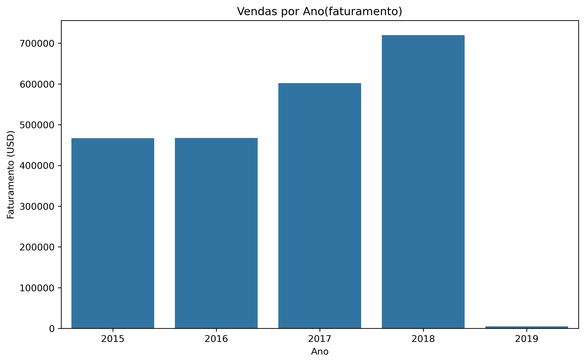
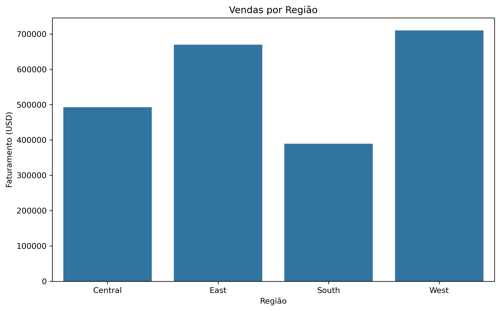

# Análise de Vendas — Superstore

## 📌 Objetivo
Analisar dados de vendas da Superstore para identificar padrões de faturamento,
distribuição por categorias e regiões, além de construir um modelo simples
para classificar vendas de alto valor.

## 📊 Dataset
O dataset contém informações de vendas, datas de pedido e envio, categorias,
segmentos e regiões. Não há informações de custo, lucro ou quantidade de itens,
o que limita análises de margem e volume.

## 🧪 Etapas do Projeto

### 1. Análise Exploratória
- Entendimento da estrutura dos dados
- Identificação de padrões temporais e por categoria
- Validação da qualidade dos dados

### 2. Limpeza e Feature Engineering
- Padronização de nomes de colunas
- Conversão de datas
- Criação de variáveis temporais e operacionais
- Documentação explícita das limitações do dataset

### 3. Análise com SQL
- Criação de banco local
- Consultas para responder perguntas de negócio
- Uso de agregações e window functions

### 4. Visualização e Storytelling
- Gráficos focados em perguntas de negócio
- Destaque de tendências e ressalvas (ex.: ano incompleto)

### 5. Modelagem
- Definição de alvo: classificação de vendas de alto valor
- Treinamento de modelos de classificação
- Avaliação e interpretação dos resultados

## 🤖 Modelos Utilizados
- Regressão Logística
- Random Forest Classifier

## 📈 Principais Análises

### Evolução do Faturamento

Observa-se crescimento consistente do faturamento entre 2015 e 2018. O valor reduzido em 2019 deve ser interpretado com cautela, uma vez que o ano está incompleto no dataset.
### Vendas por Categoria

Observa-se que a categoria de Tecnologia concentra grande parte do faturamento. Isso pode estar relacionado ao maior valor agregado dos produtos desse segmento.
### Vendas por Região

Observa-se que duas regiões concentram mais da metade do faturamento total. Isso pode indicar maior presença da empresa nessas regiões ou maior volume de vendas nesses mercados.

## ⚠️ Limitações
- Dataset não contém custo, lucro ou quantidade de itens
- Ticket médio calculado por registro, não por pedido

## 🛠️ Tecnologias
- Python (Pandas, Scikit-learn)
- SQL
- Matplotlib / Plotly

## 👤 Autor
Renan Croffi
